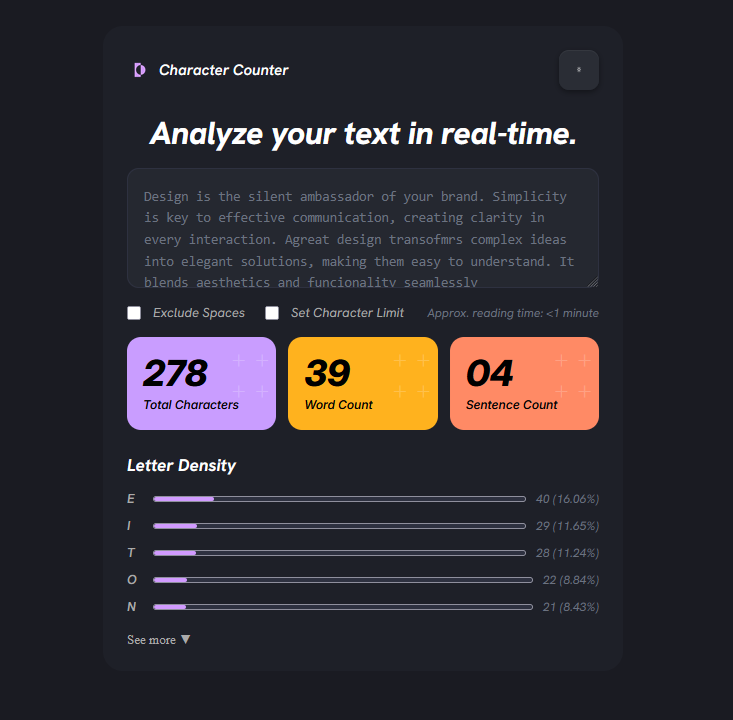

# Character Counter

Una aplicación web que analiza texto en tiempo real, mostrando estadísticas como cantidad de caracteres, palabras, oraciones y densidad de letras.

---

## 1. Objetivo del Proyecto

El objetivo del proyecto es construir una interfaz web funcional y visualmente atractiva que permita al usuario pegar o escribir un texto y obtener métricas de análisis de forma inmediata. Entre las funcionalidades principales se incluyen:

- Conteo de caracteres totales (con opción de excluir espacios)
- Conteo de palabras y oraciones
- Tiempo aproximado de lectura
- Densidad de uso de cada letra del texto
- Posibilidad de establecer un límite de caracteres

---

## 2. Tecnologías Utilizadas

| Tecnología | Uso |
|---|---|
| **HTML5** | Estructura del contenido |
| **CSS3** | Estilos, layout y diseño visual |
| **Fuente: Inter** | Tipografía del cuerpo |
| **Fuente: Hanken Grotesk** | Tipografía de títulos |

Las fuentes se importan localmente desde la carpeta `/fonts` mediante `@font-face`.

---

## 3. Cómo Organizaron el HTML

El HTML está estructurado en secciones semánticas bien diferenciadas:

- **`.navbar`** — Barra de navegación superior con el logo, nombre de la app y botón de configuración.
- **`section.input`** — Sección principal que contiene el título, el `<textarea>` donde el usuario escribe, los checkboxes de opciones y el tiempo de lectura estimado.
- **`section.stats`** — Tres tarjetas (`<article class="card">`) que muestran los contadores: Total de Caracteres, Palabras y Oraciones.
- **`section.Density`** — Lista de barras de progreso (`<progress>`) que representan la densidad de cada letra en el texto.
- **`p.see-more`** — Enlace para expandir la lista completa de letras.

Todo el contenido vive dentro de un `div.wrapper` centrado en la página.

---

## 4. Cómo Resolvieron el CSS

El layout principal se resolvió con **Flexbox** en el `body`, centrando el contenedor `.wrapper` tanto horizontal como verticalmente. Las decisiones clave fueron:

- **Centrado general:** `body` con `display: flex`, `justify-content: center` y `align-items: flex-start`, con un `div.wrapper` de `max-width: 520px`.
- **Cards de estadísticas:** Se usó `display: grid` con `grid-template-columns: repeat(3, 1fr)` para distribuir las tres tarjetas equitativamente.
- **Densidad de letras:** Cada fila usa un grid de 3 columnas (`16px 1fr auto`) para alinear la letra, la barra de progreso y el porcentaje.
- **Barras de progreso:** Se personalizaron con pseudo-elementos `::-webkit-progress-bar` y `::-webkit-progress-value` para lograr el color y border-radius deseados.
- **Botón de configuración:** Diseñado con `border-radius`, `box-shadow` con `inset` y transiciones para imitar el estilo oscuro de la imagen de referencia.
- **Tipografía local:** Se declararon dos `@font-face` apuntando a archivos `.ttf` en la carpeta `/fonts`.

---

## 5. Dificultades Encontradas

- **Estilizado de `<progress>`:** El elemento nativo tiene estilos por defecto muy difíciles de sobreescribir; fue necesario usar prefijos `-webkit-` y `-moz-` para lograr consistencia entre navegadores.
- **Alineación de la fila de densidad:** Combinar la letra, la barra y el porcentaje en una misma línea perfectamente alineada requirió ajustar el grid y el `align-items`.
- **Botón de settings:** Replicar el aspecto del botón (fondo oscuro, esquinas redondeadas, sombra sutil) a partir de una captura de pantalla requirió ajuste fino de `box-shadow` con capas `inset`.
- **Fuentes locales:** Asegurarse de que los archivos `.ttf` estuvieran correctamente referenciados en el `@font-face` para que carguen sin conexión a internet.

---

## 6. Capturas del Resultado Final

### Vista general

